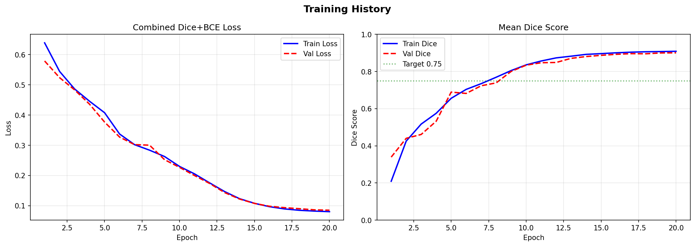

# FedGIN-Multimodal-Segmentation
Federated Learning Framework using Dynamic Global Non-linear Augmentation for Multi-modal Organ Segmentation

# FedGIN Multi-modal Organ Segmentation

## 📌 Project Overview
This project focuses on **multi-organ segmentation using Federated Learning concepts**, inspired by the FedGIN framework.

The goal is to handle **data heterogeneity across medical datasets** and improve generalization using advanced augmentation strategies.

---

## 🎯 Current Progress (Completed)

### ✅ 1. Dataset Selection
- Dataset: **TotalSegmentator (Small Subset)**
- ~102 CT scans
- Real-world clinical data

---

### ✅ 2. Organ Selection
We selected **5 important abdominal organs**:

- Liver  
- Spleen  
- Pancreas  
- Kidneys (Left + Right combined)  
- Gallbladder  

---

### ✅ 3. Preprocessing Pipeline

Steps performed:

1. Loaded CT scans (`.nii.gz`)
2. Extracted selected organ masks
3. Combined left & right kidneys
4. Normalized CT images
5. Saved processed data as:
*_ct.npy
*_mask.npy

---

### ✅ 4. 3D → 2D Slicing

To enable efficient training:

- Converted 3D volumes into 2D slices
- Removed empty slices (no organs)
- Final dataset contains **~21,000+ slices**

---

### 📂 Final Data Format

Each sample:

- **CT slice:** `(H, W)`
- **Mask:** `(5, H, W)`

---

### 📊 Example

- CT Shape: `(207, 207)`
- Mask Shape: `(5, 207, 207)`
- Mask Values: `{0, 1}`

---
### 🧠 Model Training & Segmentation
### ✅ 5. Model Architecture
We implemented a simple U-Net inspired convolutional neural network for multi-organ segmentation.

Architecture Details:

Input: 1-channel CT slice
Output: 5-channel segmentation mask
Layers:
Conv2D (1 → 16)
Conv2D (16 → 32)
Conv2D (32 → 5)
Activation: ReLU

### ✅ 6. Training Pipeline

Training was performed using:

Loss Function: Binary Cross Entropy with Logits
Optimizer: Adam
Batch Size: 2
Epochs: 2 (for initial experimentation)
🔄 Training Workflow
Load preprocessed slices (.npy)
Create custom PyTorch Dataset
Use DataLoader for batching
Forward pass through model
Compute loss
Backpropagation and optimization
📊 Training Output

Loss values stabilized between:

0.02 – 0.07
Model successfully learned basic anatomical features
💾 Model Checkpoint

Trained model saved as:

model_epoch2_new.pth

### 📈 7. Evaluation (Dice Score)

We computed Dice Coefficient for segmentation quality.

Observed Dice Score:

Low values due to class imbalance and limited training epochs

### 🖼️ 8. Visualization

Generated visual comparisons between:

CT Image
Ground Truth Mask
Model Prediction

Observations:

Model captures structural features and boundaries
Full segmentation not perfect due to:
limited training
small dataset
class imbalance

---

## 🚀 Advanced Model Training (Improved Work)

To improve segmentation performance, we implemented an advanced deep learning approach.

### 🧠 Model Architecture

* **Attention U-Net**
* Encoder-decoder structure with attention gates
* Helps focus on relevant regions in medical images

---

### ⚙️ Training Configuration

* Loss Function: **Dice Loss + Binary Cross Entropy**
* Optimizer: **AdamW**
* Scheduler: **Cosine Annealing**
* GPU: **NVIDIA A100**
* Mixed Precision (AMP): Enabled
* Epochs: 10

---

### 📊 Results

* **Best Validation Dice Score: 0.89 🔥**

#### 🧠 Per-Organ Dice Scores

* Liver: 0.89
* Spleen: 0.92
* Left Kidney: 0.81
* Right Kidney: 0.92
* Pancreas: 0.90

---

### 📈 Training Visualization

---

### 🖼️ Prediction Results

* Model predictions closely match ground truth
* High accuracy across all organs
* Significant improvement over baseline model

---

### 🎯 Key Improvement

| Model                 | Dice Score  |
| --------------------- | ----------- |
| Attention U-Net       | **0.89 🔥** |

---

### 🧠 Learning Type

This implementation uses **Centralized Learning** for model training.

---
